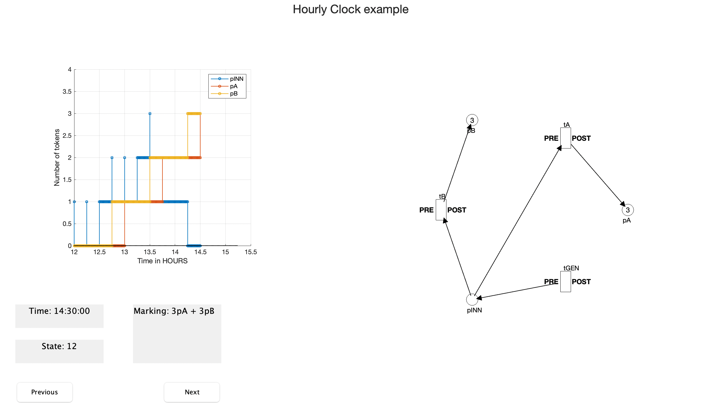

# Gplot
Gplot is a plotting tool for displaying Petri Net models in GPenSIM.

## Installation
1. Extract the ZIP file (or clone the git repository) somewhere you can easily reach it.
2. Add the src/folder to your path in MATLAB: 
* Start MATLAB:  Go to the **File** menu in MATLAB, and select “Set Path” command
* Select “Add with Subfolders”

## Feature
1. Display the definition of a Petri net, including places, transitions, and arcs (PDF).
2. Display pre-processor and post-processor of transitions.
3. Show the distribution of tokens in places at a specific time.
4. Display the change of tokens in places over time.  

 

## Usage
use Gplot
```matlab
#gplot(pns,results,{'pINN','pA', 'pB'});
gplot(pns,results,set_of_places);
```


## FeedBack
If you find any bug or have any suggestion, please do file issues. I am graceful for any feedback and will do my best to improve this package.


